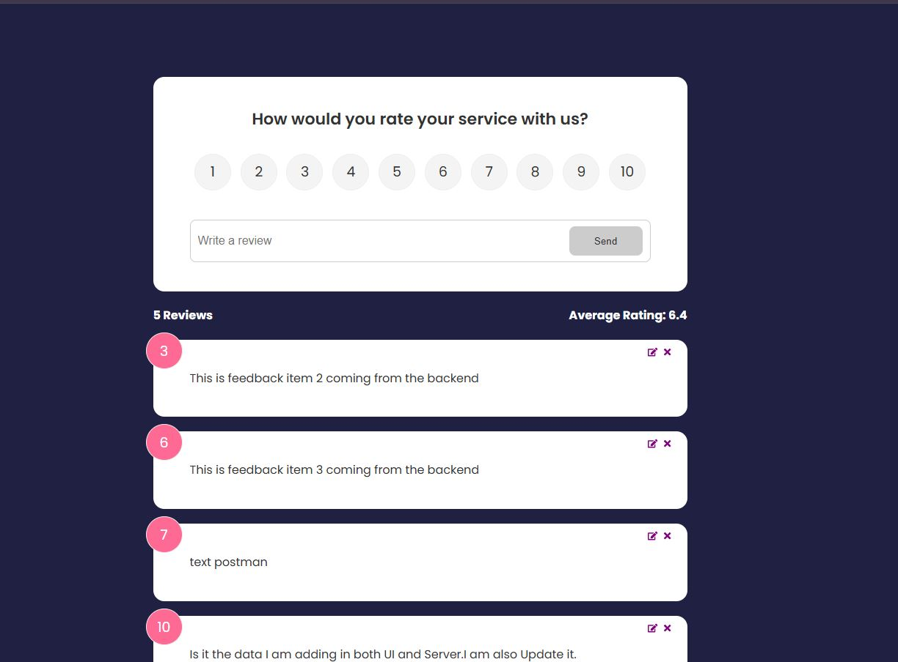

# ⭐ Feedback Rating App (MongoDB + Express + React + Vite)

A full-stack feedback app for collecting and managing user feedback with ratings. Built using **React + Vite** on the frontend and **Express + MongoDB Atlas** on the backend. Fully supports real-time CRUD operations and live backend integration.

---

## 📸 Screenshots



---

## Features

- ✅ Add, update, and delete feedback
- ✅ Real-time update without page reload
- ✅ Display average rating in real time
- ✅ Toast notifications for user actions
- ✅ Client-side routing with React Router
- ✅ MongoDB Atlas integration for persistent storage
- ✅ Express backend API with full CRUD support
- ✅ Global state with React Context API
- ✅ Clean folder structure and reusable components
- ✅ Development proxy configuration with Vite
- ✅ `.env` support for secure config

---

## 🧱 Tech Stack

| Tech               | Purpose                                   |
| ------------------ | ----------------------------------------- |
| **React**          | UI library for building components        |
| **Vite**           | Fast development server and bundler       |
| **React Router**   | Routing and page navigation               |
| **Context API**    | Manage global feedback state              |
| **Express**        | REST API backend                          |
| **MongoDB Atlas**  | Cloud database for persistent feedback    |
| **Mongoose**       | ODM to interact with MongoDB              |
| **React Toastify** | Toast feedback on actions                 |
| **Concurrently**   | Run frontend and backend with one command |
| **VS Code**        | Code editor                               |
| **Git + GitHub**   | Version control and source hosting        |

---

## 📁 Folder Structure

```
feedback-rating-app/
├── feedback-api/           # Express backend
│   ├── routes/
│   ├── models/
│   ├── server.js
│   └── .env
│
├── src/                    # React frontend
│   ├── components/
│   ├── context/
│   ├── App.jsx
│   └── main.jsx
│
├── .env                    # Frontend environment variables
├── vite.config.js
├── package.json
```

---

## ⚙️ Setup Instructions

### 1. Clone and install dependencies

```bash
git clone https://github.com/Z-Mosayebi/Feedback-Rating-App
cd feedback-rating-app
npm install
```

### 2. Configure Environment

Create two `.env` files:

#### ➤ For frontend (`.env`):

```env
VITE_API_URL=/api/feedback
```

#### ➤ For backend (`feedback-api/.env`):

```env
MONGO_URI=your-mongodb-uri
PORT=5000
```

Replace `your-mongodb-uri` with your connection string from MongoDB Atlas.

---

### 3. Run the Project Locally

```bash
npm run dev
```

This runs:

- Frontend (Vite) at `http://localhost:3000`
- Backend (Express + MongoDB) at `http://localhost:5000`

Vite will proxy API requests to the backend automatically.

---

## What I Learned

- React fundamentals: components, props, state
- State sharing through Context API
- Handling side effects with `useEffect`
- CRUD operations with a fake backend
- Managing form inputs and validations
- Modular component design
- Connecting React frontend to a real Express + MongoDB backend
- Managing global state and form validation with Context
- Creating RESTful APIs with Express
- Using `fetch` and async/await in React
- Handling MongoDB documents with Mongoose
- Deploying fullstack apps using Vercel and Render

---

## 📎 License

This project is for educational purposes and personal portfolio use.

---
